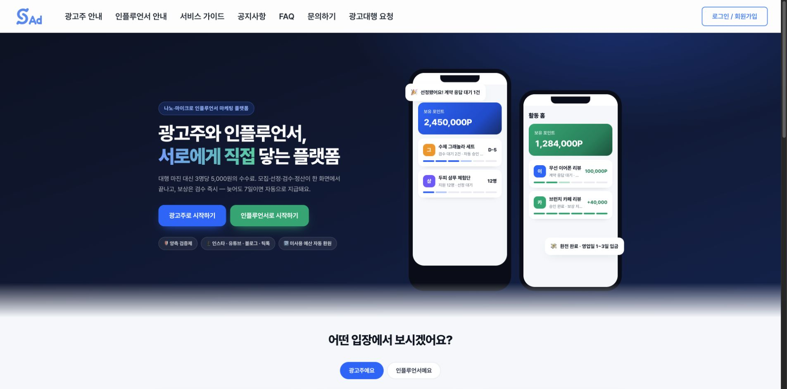
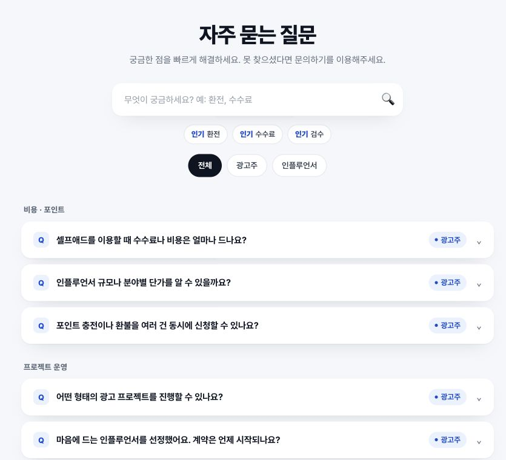
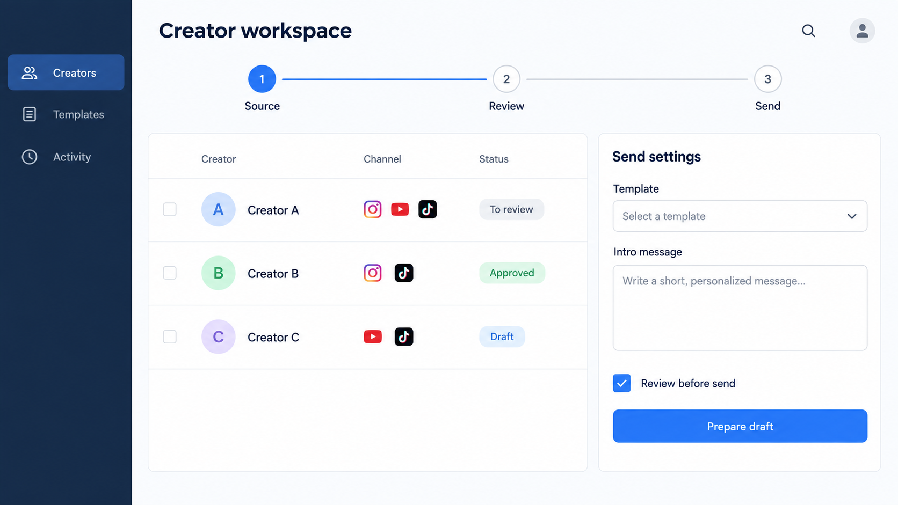
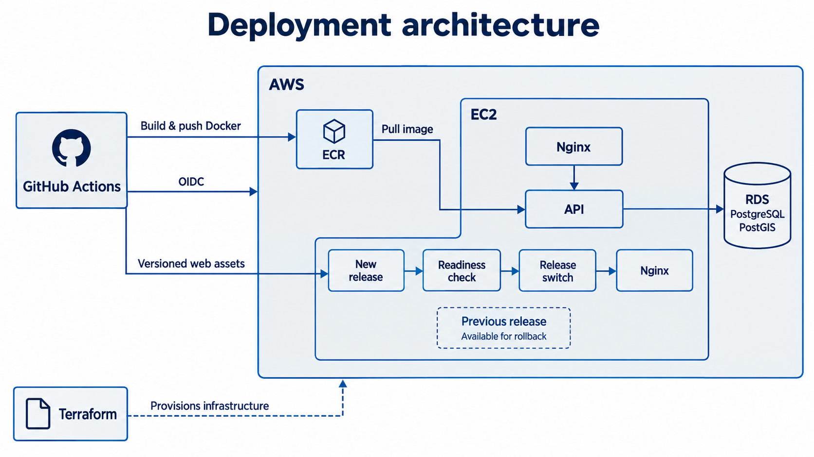
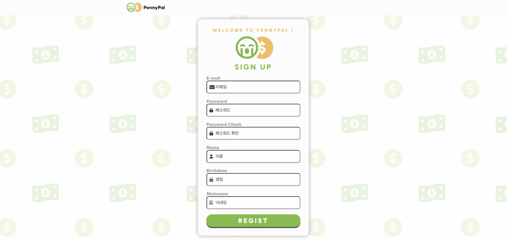
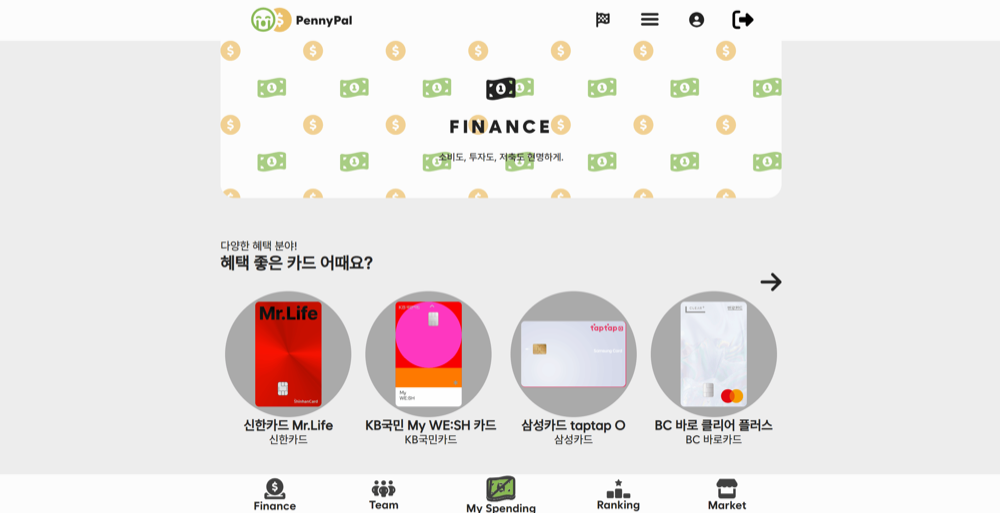
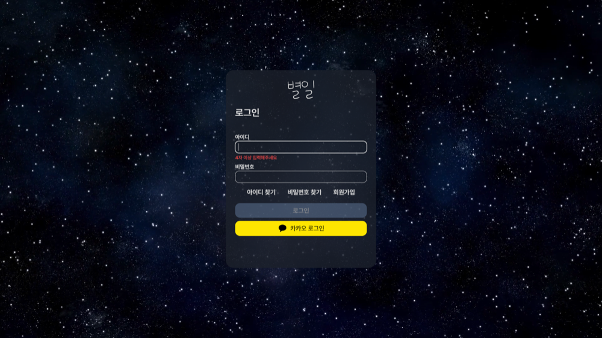

# 김동학 포트폴리오 · Ver.2

화면에서 시작해,
업무가 끝나는 곳까지.

React 기반 제품 화면과 API를 연결하고, 반복 업무를 자동화하는 도구를 만들어 왔습니다. 모바일 사용 흐름부터 데이터 처리, 배포와 운영까지 직접 맡은 사례를 소개합니다.

사용자가 일을 끝낼 수 있는 흐름을 만듭니다. 화면의 사용성, 데이터 연결, 운영의 제약을 함께 살핍니다.

## 경력

- 2026.05–06 | (주)카보 · 정규직 — 제품 프론트엔드와 업무 자동화. 2026.06.30 퇴직 후 7월부터 무급 프로젝트 참여.
- 2024.11–12 | 하나금융TI IT 직무 인턴십 3기 — 청년 일경험 과정. 인프라서비스본부 업무 지원, SIEM·피싱 사례 샌드박스 실습, 개인 EC2·Nginx·DNS·Snort 구축 실습.

## 교육

- 2026.07–12 | AI·SW마에스트로 17기 — 부산센터 본과정 진행 중. 3인 팀 산책온 개발.
- 2023.07–2024.06 | 삼성 청년 SW 아카데미 10기 — 대전 캠퍼스 Java 웹 풀스택 과정 수료 · 1,600시간. 팀 프로젝트 우수상 총 4회.
- 2023.02 | 한국기술교육대학교 졸업 — 전기공학전공 공학사 · HRD 부전공.

## Index

1. 셀프애드 (PDF 3–4)
2. IRM (PDF 5)
3. 산책온 (PDF 6)
4. SSAFY 프로젝트: PennyPal·별일 (PDF 7–8)

## 셀프애드

광고 업무를 모바일 화면으로 연결하다

광고주와 인플루언서를 연결하는 마케팅 플랫폼. 활동 홈과 업무 화면의 모바일 반응형 전환, UI/UX 리팩토링을 담당했습니다.

2026.05–현재 | 제품 프론트엔드 구현

정규직 2026.05.01–06.30 / 퇴직 후 무급 프로젝트 참여 2026.07.01–현재

현재 운영 중인 셀프애드 공개 홈 · 2026.09.14 캡처. 서비스 소개용 예시 데이터가 포함된 화면이며, 홈 전체를 개인 구현으로 제시하지 않습니다.

현재 운영 중인 FAQ · 본인 기여: FAQ·헤더 진입점·모바일 노출 구현. 이후 운영 중 변경된 내용이 포함될 수 있습니다.

**문제**

광고주와 인플루언서는 서로 다른 업무 화면을 사용합니다. 기존 서비스의 API와 화면 구조를 활용하면서 모바일에서도 활동 현황을 보고 업무를 이어갈 수 있도록 화면·이동·모달을 함께 정비해야 했습니다.

**선택과 구현**

활동 홈은 기존 API 응답을 조합하고, 마이비즈의 화면 전환은 URL과 연결했습니다. 여러 광고주 모달에는 공통 스타일과 모바일 바텀시트를 적용해 각 화면의 수정과 공통 표현을 함께 관리했습니다.

**내가 맡은 부분**

- 활동 홈: 기존 API를 조합해 인플루언서 활동 정보를 하나의 화면에 구성
- 화면 이동: 마이비즈 URL 기반 전환과 모바일 경로 정비
- 모바일 UI: 공통 모달 스타일·바텀시트 적용, 가입 동의 체크박스 표시 수정
- 유급 재직 중 FAQ·헤더 진입점·모바일 노출 구현, 퇴직 후 화면 개편 지속

**결과와 현재 상태**

활동 홈, URL 기반 화면 이동, 공통 모달 및 모바일 수정이 개인 작성 커밋에 남아 있습니다. 개별 화면 구현과 공통 사용자 흐름을 함께 다룬 경험입니다.

본인 기여: 프론트엔드 구현. 서비스 전체 UX 기획과 사업 지표는 개인 성과에 포함하지 않았습니다.

구현 기록: 249d9bf · 214eded · 16dea87 · 0a149a0

## IRM

수작업 영업을 이어지는 업무 흐름으로

영업 대상 리스트업과 메일 발송을 자동화하는 사내 도구. 수집·검토·발송·후속 처리의 설계부터 구현과 운영까지 주도했습니다.

2026.05–현재 | 설계 · 구현 · 운영 주도

정규직 2026.05.01–06.30 / 퇴직 후 무급 참여. 7월 배포 협업은 무급 참여 기간의 작업입니다.

구성 설명용 목업 · 실제 IRM 화면이 아닙니다. 채널 아이콘·데이터는 예시이며, 실제 업무 접점은 Google Sheets입니다.

**문제**

담당자가 영업 대상을 직접 리스트업하고 메일을 수작업으로 보내고 있었습니다. 수집한 데이터가 중복 관리, 발송 상태, 수신거부와 운영 이력까지 이어져야 실제 업무에 사용할 수 있었습니다.

**선택과 구현**

Google Sheets를 중복·상태·발송 이력을 관리하는 업무 접점으로 사용했습니다. 클라우드 이전은 발송과 YouTube 수집부터 적용하고, 네이버·Instagram 수집은 로컬 실행으로 구분했습니다.

**내가 맡은 부분**

- 플랫폼별 수집·정제 결과를 검토와 발송 이력에 연결
- 발송 전 검증, 한도 관리, 수신거부 토큰과 처리 경로 구성
- Fargate 실행, 이력 보존, 비밀정보와 로그 관리 및 운영 문서 작성
- 7월 대표의 보안 우려를 반영해 관리자 권한 요청을 철회하고, 실행 역할과 한정된 역할 전달 권한으로 요청 축소

**결과와 현재 상태**

사람이 하던 대상 리스트업과 메일 발송을 자동화했습니다. 실행할 수 있는 코드에 더해 발송 전 확인·후속 처리·운영 기록까지 연결했습니다.

수작업의 자동화가 확인된 변화입니다. 매출·시간 절감률은 측정 성과로 제시하지 않았습니다.

근거: 구현·운영 문서, 2026.07.10 배포 권한 요청 수정 기록

## 산책온

지도 표시와 서비스 배포의 경계를 나누다

3인 팀의 산책 코스 추천 서비스. AWS PoC·CI/CD·서비스 통합을 주도하고, Web Worker와 Canvas 기반 그늘 표시를 구현했습니다.

2026년 진행 중 | Cloud/DevOps · 서비스 통합 리드

본과정 2026.07–12. 팀 합의 아래 아키텍처 선택과 구현 트레이드오프를 주도했습니다.

본인 담당 CI/CD·배포 설계의 설명용 목업. Nginx는 서비스 경로와 릴리스 흐름에서 같은 구성요소를 각각 표시했습니다.

**문제**

서버의 공간 평가 실험과 사용자가 보는 지도 표시를 함께 변경하면 배포·검증 범위가 커집니다. 지도를 이동하거나 표시를 끈 뒤에도 이전 비동기 계산 결과가 도착할 수 있어 요청의 수명주기도 관리해야 했습니다.

**선택과 구현**

지도 표시를 서버·DB 변경과 분리했습니다. 정적 타일을 읽고 Worker에서 건물 그림자를 계산한 뒤 Canvas로 표시하며, 취소와 revision 검사를 통해 이전 결과의 반영을 제어했습니다.

**내가 맡은 부분**

- viewport 변경·토글 OFF·dispose 시 요청과 계산 취소
- 이전 revision 결과 차단, 네트워크·Worker 타임아웃 처리
- 건물·가로수 독립 로딩, 자료 manifest·checksum 검증
- Terraform·OIDC·Nginx로 웹/API PoC 배포 및 버전별 release·복구 경계 구성

**결과와 현재 상태**

지도 표시 분리와 후속 보완의 로컬 병합 기록을 확인했습니다. PoC는 2026.08.18 기록에서 공개 페이지 HTTP 200, API readiness, 지도 렌더링이 확인됩니다.

진행 중: 그늘 표시 운영 배포와 추천 점수 연결. 가로수는 위치 표식이며 실제 수관·그늘 면적을 뜻하지 않습니다.

개인 커밋: f96e805 · 723e2a1 · 3e0f8e6 · e388447 / PoC·지도 검증 기록

## SSAFY 프로젝트

### PennyPal

가입 화면, 검증, 단계 상태를 분리하다

소비 관리와 금융 상품 탐색을 제공하는 팀 프로젝트. 회원가입과 회원 API 연동, 카드·주식 조건 검색을 담당했습니다.

2024.02–04 | 프론트엔드 개발

팀 성과: SSAFY 특화 프로젝트 우수상 · 대전 캠퍼스 반 내 3위

회원가입 화면 · UI와 검증 모델 분리

금융 탐색 화면 · 검색·데이터 연결 기여, 팀 화면 디자인 포함

**문제**

회원가입 과정에는 화면 표시, 폼 검증, 단계 전환과 API 연결이 함께 존재합니다. 이를 한 화면에서 다루는 구조에서 각 책임을 나누고 팀원과 같은 구조로 작업할 필요가 있었습니다.

**선택과 구현**

다른 프론트엔드 팀원과 협의한 FSD 구조에 맞춰 가입 UI와 검증 모델을 분리했습니다. 약관·입력·완료 단계는 Redux 상태로 관리했습니다.

**내가 맡은 부분**

- 회원가입 UI와 검증 모델 분리, 단계별 화면 상태 연결
- 로그인·마이페이지 API 연동과 로그인 상태 기반 화면 이동
- 카드사·카드명·금액 범위·주식 검색 조건 구현
- 무한 스크롤 라이브러리를 사용한 페이지별 추가 로딩

**결과와 현재 상태**

화면·검증·단계 상태의 변경 위치를 구분한 가입 기능을 구현했습니다. 팀은 특화 프로젝트 우수상을 받았으며, 수상은 팀 전체의 성과입니다.

본인 기여: 회원 기능과 금융 탐색 구현. 팀 전체 아키텍처 단독 설계로 확대하지 않았습니다.

개인 커밋: 3652428 · acc6d15 · 5d7e461 · a9c426b

### 별일

API 응답을 사용자가 듣는 음성으로

일기를 기록하고 음성으로 듣는 서비스. 회원·랜딩·TTS 화면과 음성 요청·재생·재전송 흐름을 구현했습니다.

2024.01–02 | 회원 · TTS 프론트엔드

팀 성과: SSAFY 공통 프로젝트 우수상 · 대전 캠퍼스 반 내 2위

별일 저장소의 실제 서비스 UI · 팀 결과물. 본인 담당은 회원·랜딩·TTS 프론트엔드이며, Three.js 화면과 음성 합성 모델은 팀원 기여입니다.

**문제**

음성 생성 API 호출이 성공해도 응답이 곧바로 브라우저에서 재생되는 것은 아닙니다. 응답 객체와 바이너리 데이터를 구분하고, 사용자가 재생·전송할 수 있는 형태로 연결해야 했습니다.

**선택과 구현**

음성 생성 응답을 Blob으로 수신하고 object URL을 만들어 브라우저 오디오 재생에 연결했습니다. 요청부터 재생·재전송까지의 프론트엔드 흐름을 구성했습니다.

**내가 맡은 부분**

- 회원가입·회원정보·랜딩 및 TTS 화면의 UI·API 연결
- 바이너리 응답을 Blob으로 받아 object URL 생성
- 브라우저 오디오 재생과 생성 음성 재전송 구현
- 화면 상태와 요청 오류 처리 구성

**결과와 현재 상태**

서버에서 생성된 음성을 브라우저에서 재생하고 다시 전송하는 경로를 구현했습니다. a21e0a5·4f035d0 커밋에서 응답 처리와 재생 변경을 확인할 수 있습니다.

본인 기여: 회원·TTS 프론트엔드. 음성 합성 모델과 Three.js 3D 화면은 다른 팀원의 구현 범위입니다.

개인 커밋: a21e0a5 · 4f035d0
